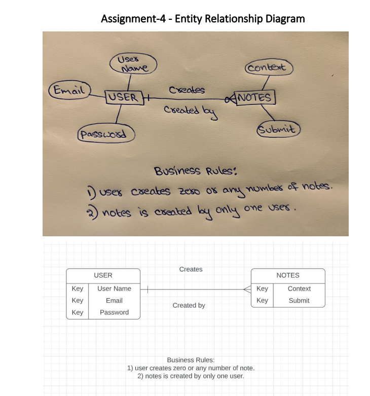

Login - user name,password,check box for loging;login button;Navigation bar for navigating to registration,home and note;flex for images.
Registration - Firstname,Lastname,Username,Password and check box for registering;Navigation bar for navigating to home and login;flex for boxes.
Home - Used flex for images and Navigation bar for navigating to login and registration.
Note - used for taking notes.

[]